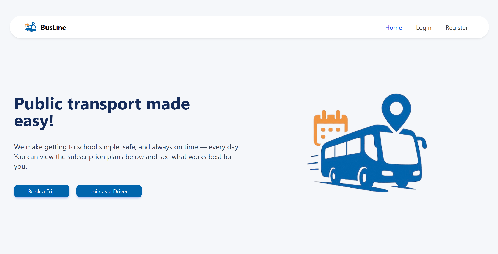
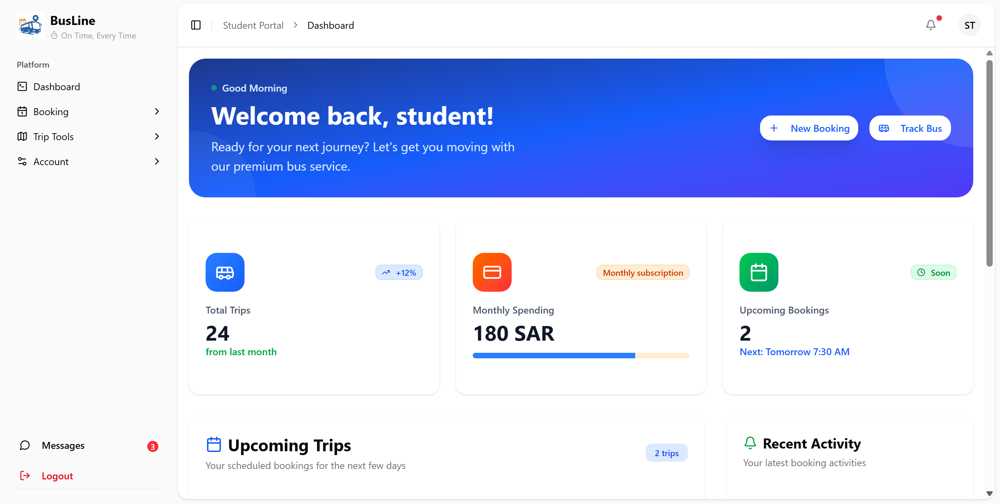
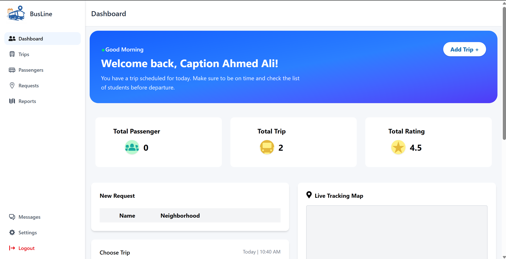
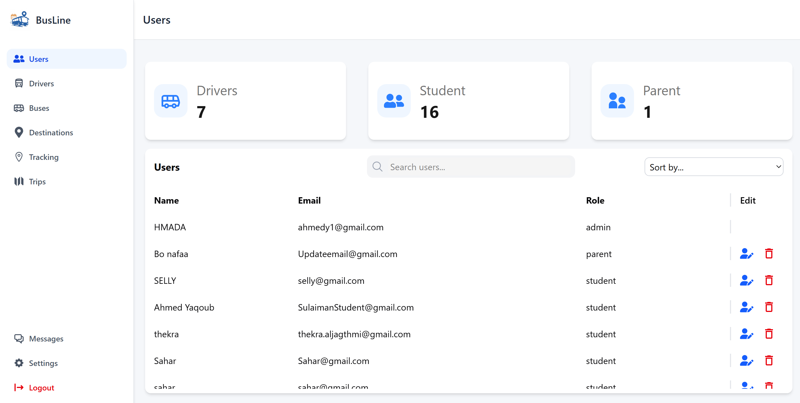

#  خط الحافلات - منصة النقل الحديثة

<div dir="rtl">

في ظل التحديات اليومية التي يواجهها العديد من الطلاب والطالبات في الوصول إلى مدارسهم وجامعاتهم، خاصة في المناطق التي لا تغطيها وسائل النقل العام، ظهرت الحاجة إلى حل تقني ينظم خدمات النقل التعاقدي الخاص، ويسهل الربط بين الركاب وسائقي الحافلات الخاصة بناءً على الأحياء السكنية والوجهات المحددة (مثل الجامعات، المدارس). المنصة تستهدف تقنين الخدمة، ضمان الأمان، وتوفير حلول مرنة وسهلة.

تطبيق شامل لنقل الحافلات مبني بـ React، يتضمن لوحات تحكم قائمة على الأدوار للمشرفين والسائقين والطلاب مع الحجز في الوقت الفعلي وإدارة الرحلات وواجهة مستخدم متقدمة.

</div>

## 📋 جدول المحتويات

- [الميزات](#-الميزات)
- [المكتبات والتقنيات](#-المكتبات-والتقنيات)
- [لقطات الشاشة](#-لقطات-الشاشة)
- [التثبيت](#-التثبيت)
- [الاستخدام](#-الاستخدام)
- [المصادقة](#-المصادقة)
- [لوحات التحكم](#-لوحات-التحكم)
- [التصميم والستايل](#-التصميم-والستايل)
- [الميزات بالتفصيل](#-الميزات-بالتفصيل)
- [تحسينات الأداء](#-تحسينات-الأداء)
- [المساهمة](#المساهمة)
- [الفريق](#-الفريق)

## ✨ الميزات

<div dir="rtl">

### 🎯 الميزات الأساسية

- **مصادقة متعددة الأدوار**: أنظمة تسجيل دخول للمشرف والسائق والطالب
- **الحجز في الوقت الفعلي**: نظام حجز تفاعلي مع تحديثات الرحلات المباشرة
- **لوحة تحكم المشرف**: عمليات CRUD كاملة للمستخدمين والسائقين والحافلات والرحلات والوجهات
- **لوحة تحكم السائق**: إدارة الرحلات وتتبع الركاب ونظرة عامة على الأرباح
- **لوحة تحكم الطالب**: حجز الرحلات وعرض التاريخ وتتبع الحافلات
- **واجهة مستخدم عصرية**: تصميم مهني ومتجاوب مع رسوم متحركة سلسة

### 🚀 الميزات المتقدمة

- **تكامل خرائط جوجل**: خرائط تفاعلية مع رسم الوجهات
- **إشعارات Toast**: نظام ردود فعل عصري وسهل الاستخدام
- **البحث والتصفية**: بحث وفرز متقدم عبر جميع لوحات التحكم
- **نظام المراجعات**: شهادات العملاء ونظام التقييم
- **التحديثات المباشرة**: حالة الرحلة المباشرة وتأكيدات الحجز

</div>

## 🛠 المكتبات والتقنيات

### الواجهة الأمامية

- **React 19** - React حديث مع أحدث الميزات
- **Vite** - أداة بناء سريعة البرق
- **Tailwind CSS** - إطار عمل CSS يركز على الأدوات
- **Framer Motion** - رسوم متحركة وانتقالات متقدمة
- **React Router** - توجيه من جانب العميل
- **React Hot Toast** - نظام إشعارات حديث

### الواجهة الخلفية

- **المستودع**: [Bus-Line Backend](https://github.com/AhmedY29/Bus-Line-Backend)
- **التقنية**: Node.js مع TypeScript
- **Express** - إطار عمل ويب سريع وغير متحيز
- **bcrypt** - تشفير كلمات المرور الآمن للمصادقة
- **قاعدة البيانات**: MongoDB مع Mongoose ODM
- **المصادقة**: نظام مصادقة قائم على JWT
- **API**: نقاط نهاية RESTful API
- **رفع الملفات**: تكامل Cloudinary لإدارة الصور
- **Socket.io** - اتصال ثنائي الاتجاه في الوقت الفعلي وتتبع

### مكتبات واجهة المستخدم

- **React Icons** - مكتبة أيقونات شاملة
- **Lucide React** - أيقونات جميلة ومتسقة
- **Tailwind Scrollbar Hide** - تصميم شريط التمرير المخصص

### الخرائط والتكامل

- **Mapbox GL JS** - خرائط تفاعلية وملاحة
- **Axios** - عميل HTTP لطلبات API
- **Socket.io Client** - اتصال في الوقت الفعلي
- **Cloudinary** - منصة إدارة الصور والأصول

### النشر والاستضافة

- **Render** - منصة سحابية لاستضافة تطبيقات الخادم وكامل المكدس

## 📸 لقطات الشاشة

### 🏠 الصفحة الرئيسية


_صفحة رئيسية عصرية ونظيفة مع حجز الرحلات وخيارات تسجيل السائق_

### 🎓 لوحة تحكم الطالب


_بوابة طالب شاملة مع إدارة الحجوزات وتاريخ الرحلات والتتبع في الوقت الفعلي_

### 🚗 لوحة تحكم السائق


_واجهة سائق مهنية مع إدارة الرحلات وتفاصيل الركاب ومقاييس الأداء_

### 👨‍💼 لوحة تحكم المشرف - إدارة المستخدمين


_نظام إدارة مستخدمين كامل مع التحكم في الوصول القائم على الأدوار وعمليات CRUD_

### 🚌 لوحة تحكم المشرف - إدارة السائقين

_إدارة سائقين متقدمة مع موافقة التطبيق والتحقق من الوثائق وتتبع الأداء_

### 🗺️ لوحة تحكم المشرف - إدارة الوجهات

_إدارة وجهات تفاعلية مع تكامل خرائط جوجل واستخراج الإحداثيات_

### 📱 التصميم المتجاوب

_واجهة محسنة للجوال تضمن تجربة سلسة عبر جميع الأجهزة_

### 🔐 نظام المصادقة

_تسجيل دخول آمن وتسجيل مع إعادة توجيه قائمة على الأدوار_

## 🚀 التثبيت

<div dir="rtl">

### المتطلبات المسبقة

- Node.js (الإصدار 18 أو أحدث)
- npm أو yarn مدير الحزم
- Git

</div>

## 📖 الاستخدام

<div dir="rtl">

### البدء

1. **الصفحة الرئيسية**: تصفح الرحلات المتاحة وعرض حزم السفر
2. **المصادقة**: التسجيل كطالب أو سائق، أو تسجيل الدخول كمشرف
3. **الحجز**: اختيار الرحلات والدفع وإكمال الحجوزات
4. **لوحة التحكم**: الوصول إلى الميزات وأدوات الإدارة الخاصة بالدور

### أدوار المستخدمين

#### 👨‍💼 المشرف

- إدارة المستخدمين والسائقين والحافلات والرحلات والوجهات
- عرض التحليلات وإنشاء التقارير
- الموافقة/رفض طلبات السائقين
- تكوين النظام الكامل

#### 🚗 السائق

- عرض الرحلات المعينة وقوائم الركاب
- تحديث حالة الرحلة وإدارة الأرباح
- رفع رخص السائقين

#### 🎓 الطالب

- تصفح وحجز الرحلات المتاحة
- عرض تاريخ الحجوزات وتفاصيل الرحلات
- تتبع الحافلات في الوقت الفعلي
- ترك المراجعات والتقييمات

</div>

## 🔐 المصادقة

<div dir="rtl">

يستخدم التطبيق مصادقة قائمة على JWT مع التحكم في الوصول القائم على الأدوار:

- **رموز JWT**: مخزنة في localStorage
- **التحقق من الدور**: حماية المسار من جانب العميل
- **المسارات المحمية**: صفحات محددة للمشرف والسائق والطالب
- **إعادة التوجيه التلقائي**: بناءً على أدوار المستخدمين بعد تسجيل الدخول

</div>

### بيانات تسجيل الدخول

```javascript
// مشرف
email: "admin@busline.com";
password: "admin123";

// سائق
email: "driver@busline.com";
password: "driver123";

// طالب
email: "student@busline.com";
password: "student123";
```

## 📊 لوحات التحكم

<div dir="rtl">

### ميزات لوحة تحكم المشرف

- **إدارة المستخدمين**: عمليات CRUD مع البحث/التصفية
- **إدارة السائقين**: الموافقة/رفض الطلبات وإدارة الوثائق
- **إدارة الحافلات**: تسجيل المركبات وتتبع الصيانة
- **إدارة الرحلات**: تخطيط المسارات وإدارة الجداول
- **إدارة الوجهات**: تكامل خرائط جوجل واستخراج الإحداثيات

### ميزات لوحة تحكم السائق

- **نظرة عامة على الرحلات**: الرحلات المعينة وتفاصيل الركاب
- **متتبع الأرباح**: تقارير الإيرادات وتاريخ الدفعات
- **إدارة المركبات**: رفع الوثائق وحالة التفتيش

### ميزات لوحة تحكم الطالب

- **حجز الرحلات**: البحث والتصفية وحجز الرحلات المتاحة
- **تاريخ الحجوزات**: تفاصيل الرحلات الماضية والقادمة
- **التتبع المباشر**: تتبع موقع الحافلة في الوقت الفعلي
- **المراجعات والتقييمات**: ترك ملاحظات للرحلات المكتملة

</div>

## 🎨 التصميم والستايل

<div dir="rtl">

### نظام التصميم

- **مخطط الألوان**: الأزرق الأساسي (#0165AD)، الرمادي المهني
- **الطباعة**: تسلسل خطوط حديث وقابل للقراءة
- **المسافات**: حشو وهوامش متسقة
- **الرسوم المتحركة**: انتقالات سلسة وتفاعلات دقيقة

### التصميم المتجاوب

- **الجوال أولاً**: محسن للأجهزة المحمولة
- **دعم الأجهزة اللوحية**: تكيفات الشاشة المتوسطة
- **سطح المكتب**: تجربة سطح مكتب كاملة الميزات

</div>

## 📱 الميزات بالتفصيل

<div dir="rtl">

### تكامل خرائط جوجل

- **رسم الوجهات**: إضافة وجهات عبر روابط خرائط جوجل
- **استخراج الإحداثيات**: استخراج تلقائي للإحداثيات من تنسيقات الروابط المختلفة
- **دعم الروابط القصيرة**: التعامل مع روابط maps.app.goo.gl
- **خرائط تفاعلية**: تتبع الحافلات في الوقت الفعلي وتصور المسارات

### نظام رفع الصور

- **التحقق من الملفات**: فحص النوع والحجم
- **مؤشرات التقدم**: ردود فعل حالة الرفع
- **وظيفة المعاينة**: صور مصغرة للصور
- **معالجة الأخطاء**: رسائل خطأ شاملة

### نظام إشعارات Toast

- **تصميم حديث**: إشعارات مصممة خصيصاً
- **أنواع متعددة**: نجاح، خطأ، تحذير، معلومات
- **حوارات تأكيد**: استبدال تنبيهات المتصفح
- **الإغلاق التلقائي**: إعدادات مهلة زمنية قابلة للتكوين

</div>

## 🚀 تحسينات الأداء

<div dir="rtl">

- **تقسيم الكود**: تقسيم الكود القائم على المسار
- **التحميل البطيء**: تحميل المكونات البطيء
- **تحسين الصور**: أصول مضغوطة
- **تحليل الحزمة**: حجم بناء محسن
- **استراتيجية التخزين المؤقت**: تخزين مؤقت فعال لاستجابات API

### إرشادات المساهمة

- اتبع نمط الكود والاتفاقيات الموجودة
- أضف اختبارات للميزات الجديدة
- قم بتحديث الوثائق حسب الحاجة
- تأكد من نجاح جميع الفحوصات قبل الإرسال

</div>

## 👥 الفريق

<div dir="rtl">

| الاسم | LinkedIn | GitHub |
|-------|----------|--------|
| **أحمد الصالح** | [](https://www.linkedin.com/in/ahmed-y-alsaleh/) | [](https://github.com/AhmedY29) |
| **ذكرى الجغثمي** | [](https://www.linkedin.com/in/thekra-aljagthmi/) | [](https://github.com/ItsThekra) |
| **سليمان الفوزان** | [](https://www.linkedin.com/in/sulaiman-alfawzan/) | [](https://github.com/Sulaiman-F) |
| **سحر فارس** | [](https://www.linkedin.com/in/sahar-mansour-/) | [](https://github.com/SaharFaris1) |

</div>

---
